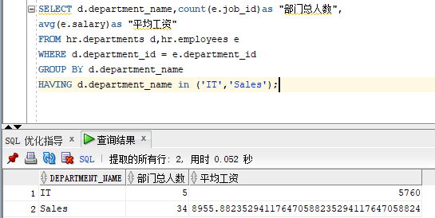

###姓名：唐翰凌
###学号：201810414122
###班级：软件工程一班

# ·查询语句一：
    SELECT d.department_name,count(e.job_id)as "部门总人数",
    avg(e.salary)as "平均工资"
    from hr.departments d,hr.employees e
    where d.department_id = e.department_id
    and d.department_name in ('IT','Sales')
    GROUP BY d.department_name;

- oracle指导优化：

    1.查询结果：通过创建一个或者多个索引可以改进此语句的执行计划。
    2.建议：考虑运行可以改进物理方案设计的访问指导或者创建推荐的索引。
    3.原理：创建推荐的索引可以显著的改进此语句的执行计划。但是，使用典型的SQL工作量运行"访问指导"可能比单个语句更不可行。通过这种方法可以获得全面的索引维护的开销和附加的空间消耗。

# ·查询语句二：
    SELECT d.department_name,count(e.job_id)as "部门总人数",
    avg(e.salary)as "平均工资"
    FROM hr.departments d,hr.employees e
    WHERE d.department_id = e.department_id
    GROUP BY d.department_name
    HAVING d.department_name in ('IT','Sales');

- oracle指导优化：

    1.查询结果：无
    2.建议：无
    3.原理：无

# ·查询语句三：
    SELECT d.department_name,count(e.job_id)as "部门总人数",
    avg(e.salary)as "平均工资"
    FROM hr.departments d
    inner join hr.employees e on d.department_id = e.department_id
    GROUP BY d.department_name
    HAVING d.department_name in ('IT','Sales');

- oracle指导优化：
    1.查询结果：无
    2.建议：无
    3.原理：无
- 查询分析：运用内连接的方法，返回两张表中相等id的数据。
    

# ·结论：
    查询2的运行时间最短且无优化可能，故查询2最佳。