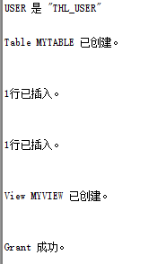

###姓名：唐翰凌
###学号：201810414122
###班级：软件工程一班

# ·以system登录到pdborcl，创建角色thl_view和用户thl_user，并授权和分配空间：
    CREATE ROLE thl_view;
    GRANT connect,resource,CREATE VIEW TO thl_view;
    CREATE USER thl_user IDENTIFIED BY 123 DEFAULT TABLESPACE users TEMPORARY TABLESPACE temp;
    ALTER USER thl_user QUOTA 50M ON users;
    GRANT thl_view TO thl_user;

# ·新用户thl_user连接到pdborcl，创建表mytable和视图myview，插入数据，最后将myview的SELECT对象权限授予hr用户：
    show user;
    CREATE TABLE mytable (id number,name varchar(50));
    INSERT INTO mytable(id,name)VALUES(1,'zhang');
    INSERT INTO mytable(id,name)VALUES (2,'wang');
    CREATE VIEW myview AS SELECT name FROM mytable;
    SELECT * FROM myview;
    GRANT SELECT ON myview TO hr;

# ·用户hr连接到pdborcl，查询thl_user授予它的视图myview：
    SELECT * FROM thl_user.myview;

  
    

# ·查看表空间的数据库文件，以及每个文件的磁盘占用情况：
    SELECT tablespace_name,FILE_NAME,BYTES/1024/1024 MB,MAXBYTES/1024/1024 MAX_MB,autoextensible FROM dba_data_files  WHERE  tablespace_name='USERS';
    SELECT a.tablespace_name "表空间名",Total/1024/1024 "大小MB",
    free/1024/1024 "剩余MB",( total - free )/1024/1024 "使用MB",
    Round(( total - free )/ total,4)* 100 "使用率%"
    from (SELECT tablespace_name,Sum(bytes)free
            FROM   dba_free_space group  BY tablespace_name)a,
        (SELECT tablespace_name,Sum(bytes)total FROM dba_data_files
            group  BY tablespace_name)b
    where  a.tablespace_name = b.tablespace_name;

