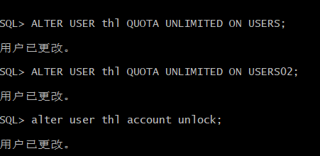

###姓名：唐翰凌
###学号：201810414122
###班级：软件工程一班
###用户名：thl
# 实验目的
了解Oracle表和视图的概念，学习使用SQL语句Create Table创建表，学习Select语句插入，修改，删除以及查询数据，学习使用SQL语句创建视图，学习部分存储过程和触发器的使用。

# 实验场景：
假设有一个生产某个产品的单位，单位接受网上订单进行产品的销售。通过实验模拟这个单位的部分信息：员工表，部门表，订单表，订单详单表。

# 实验内容：

## 录入数据：
要求至少有1万个订单，每个订单至少有4个详单。至少有两个部门，每个部门至少有1个员工，其中只有一个人没有领导，一个领导至少有一个下属，并且它的下属是另一个人的领导（比如A领导B，B领导C）。

## 序列的应用
插入ORDERS和ORDER_DETAILS 两个表的数据时，主键ORDERS.ORDER_ID, ORDER_DETAILS.ID的值必须通过序列SEQ_ORDER_ID和SEQ_ORDER_ID取得，不能手工输入一个数字。

## 触发器的应用：
维护ORDER_DETAILS的数据时（insert,delete,update）要同步更新ORDERS表订单应收货款ORDERS.Trade_Receivable的值。

## 查询数据：
1.查询某个员工的信息
2.递归查询某个员工及其所有下属，子下属员工。
3.查询订单表，并且包括订单的订单应收货款: Trade_Receivable= sum(订单详单表.ProductNum*订单详单表.ProductPrice)- Discount。
4.查询订单详表，要求显示订单的客户名称和客户电话，产品类型用汉字描述。
5.查询出所有空订单，即没有订单详单的订单。
6.查询部门表，同时显示部门的负责人姓名。
7.查询部门表，统计每个部门的销售总金额。

# ·以system账号登录创建自己的账号thl：
    [student@deep02 ~]$sqlplus system/123@localhost/pdborcl
    CREATE USER STUDY IDENTIFIED BY 123
    DEFAULT TABLESPACE "USERS"
    TEMPORARY TABLESPACE "TEMP";

# ·更改用户权限：
    -- QUOTAS
    ALTER USER STUDY QUOTA UNLIMITED ON USERS;
    ALTER USER STUDY QUOTA UNLIMITED ON USERS02;
    ALTER USER STUDY ACCOUNT UNLOCK;

    -- ROLES
    GRANT "CONNECT" TO STUDY WITH ADMIN OPTION;
    GRANT "RESOURCE" TO STUDY WITH ADMIN OPTION;
    ALTER USER STUDY DEFAULT ROLE "CONNECT","RESOURCE";

    -- SYSTEM PRIVILEGES
    GRANT CREATE VIEW TO zwd WITH ADMIN OPTION;

# ·创建表DEPARTMENTS：
   CREATE TABLE DEPARTMENTS
(
  DEPARTMENT_ID NUMBER(6, 0) NOT NULL
, DEPARTMENT_NAME VARCHAR2(40 BYTE) NOT NULL
, CONSTRAINT DEPARTMENTS_PK PRIMARY KEY
  (
    DEPARTMENT_ID
  )
  USING INDEX
  (
      CREATE UNIQUE INDEX DEPARTMENTS_PK ON DEPARTMENTS (DEPARTMENT_ID ASC)
      NOLOGGING
      TABLESPACE USERS
      PCTFREE 10
      INITRANS 2
      STORAGE
      (
        INITIAL 65536
        NEXT 1048576
        MINEXTENTS 1
        MAXEXTENTS UNLIMITED
        BUFFER_POOL DEFAULT
      )
      NOPARALLEL
  )
  ENABLE
)
NOLOGGING
TABLESPACE USERS
PCTFREE 10
INITRANS 1
STORAGE
(
  INITIAL 65536
  NEXT 1048576
  MINEXTENTS 1
  MAXEXTENTS UNLIMITED
  BUFFER_POOL DEFAULT
)
NOCOMPRESS NO INMEMORY NOPARALLEL;

# ·创建表EMPLOYEES：
   CREATE TABLE EMPLOYEES
(
  EMPLOYEE_ID NUMBER(6, 0) NOT NULL
, NAME VARCHAR2(40 BYTE) NOT NULL
, EMAIL VARCHAR2(40 BYTE)
, PHONE_NUMBER VARCHAR2(40 BYTE)
, HIRE_DATE DATE NOT NULL
, SALARY NUMBER(8, 2)
, MANAGER_ID NUMBER(6, 0)
, DEPARTMENT_ID NUMBER(6, 0)
, PHOTO BLOB
, CONSTRAINT EMPLOYEES_PK PRIMARY KEY
  (
    EMPLOYEE_ID
  )
  USING INDEX
  (
      CREATE UNIQUE INDEX EMPLOYEES_PK ON EMPLOYEES (EMPLOYEE_ID ASC)
      NOLOGGING
      TABLESPACE USERS
      PCTFREE 10
      INITRANS 2
      STORAGE
      (
        INITIAL 65536
        NEXT 1048576
        MINEXTENTS 1
        MAXEXTENTS UNLIMITED
        BUFFER_POOL DEFAULT
      )
      NOPARALLEL
  )
  ENABLE
)
NOLOGGING
TABLESPACE USERS
PCTFREE 10
INITRANS 1
STORAGE
(
  INITIAL 65536
  NEXT 1048576
  MINEXTENTS 1
  MAXEXTENTS UNLIMITED
  BUFFER_POOL DEFAULT
)
NOCOMPRESS
NO INMEMORY
NOPARALLEL
LOB (PHOTO) STORE AS SYS_LOB0000092017C00009$$
(
  ENABLE STORAGE IN ROW
  CHUNK 8192
  NOCACHE
  NOLOGGING
  TABLESPACE USERS
  STORAGE
  (
    INITIAL 106496
    NEXT 1048576
    MINEXTENTS 1
    MAXEXTENTS UNLIMITED
    BUFFER_POOL DEFAULT
  )
);

CREATE INDEX EMPLOYEES_INDEX1_NAME ON EMPLOYEES (NAME ASC)
NOLOGGING
TABLESPACE USERS
PCTFREE 10
INITRANS 2
STORAGE
(
  INITIAL 65536
  NEXT 1048576
  MINEXTENTS 1
  MAXEXTENTS UNLIMITED
  BUFFER_POOL DEFAULT
)
NOPARALLEL;

ALTER TABLE EMPLOYEES
ADD CONSTRAINT EMPLOYEES_FK1 FOREIGN KEY
(
  DEPARTMENT_ID
)
REFERENCES DEPARTMENTS
(
  DEPARTMENT_ID
)
ENABLE;

ALTER TABLE EMPLOYEES
ADD CONSTRAINT EMPLOYEES_FK2 FOREIGN KEY
(
  MANAGER_ID
)
REFERENCES EMPLOYEES
(
  EMPLOYEE_ID
)
ON DELETE SET NULL ENABLE;

ALTER TABLE EMPLOYEES
ADD CONSTRAINT EMPLOYEES_CHK1 CHECK
(SALARY>0)
ENABLE;

ALTER TABLE EMPLOYEES
ADD CONSTRAINT EMPLOYEES_CHK2 CHECK
(EMPLOYEE_ID<>MANAGER_ID)
ENABLE;

ALTER TABLE EMPLOYEES
ADD CONSTRAINT EMPLOYEES_EMPLOYEE_MANAGER_ID CHECK
(MANAGER_ID<>EMPLOYEE_ID)
ENABLE;

ALTER TABLE EMPLOYEES
ADD CONSTRAINT EMPLOYEES_SALARY CHECK
(SALARY>0)
ENABLE;

CREATE TABLE PRODUCTS
(
  PRODUCT_NAME VARCHAR2(40 BYTE) NOT NULL
, PRODUCT_TYPE VARCHAR2(40 BYTE) NOT NULL
, CONSTRAINT PRODUCTS_PK PRIMARY KEY
  (
    PRODUCT_NAME
  )
  ENABLE
)
LOGGING
TABLESPACE "USERS"
PCTFREE 10
INITRANS 1
STORAGE
(
  INITIAL 65536
  NEXT 1048576
  MINEXTENTS 1
  MAXEXTENTS 2147483645
  BUFFER_POOL DEFAULT
);

ALTER TABLE PRODUCTS
ADD CONSTRAINT PRODUCTS_CHK1 CHECK
(PRODUCT_TYPE IN ('耗材', '手机', '电脑'))
ENABLE;

 

# ·创建表ORDER_ID_TEMP：
    CREATE GLOBAL TEMPORARY TABLE "ORDER_ID_TEMP"
    (	"ORDER_ID" NUMBER(10,0) NOT NULL ENABLE,
	 CONSTRAINT "ORDER_ID_TEMP_PK" PRIMARY KEY ("ORDER_ID") ENABLE
    ) ON COMMIT DELETE ROWS ;

     COMMENT ON TABLE "ORDER_ID_TEMP"  IS '用于触发器存储临时ORDER_ID';

# ·创建表ORDERS：
   CREATE TABLE ORDERS
(
  ORDER_ID NUMBER(10, 0) NOT NULL
, CUSTOMER_NAME VARCHAR2(40 BYTE) NOT NULL
, CUSTOMER_TEL VARCHAR2(40 BYTE) NOT NULL
, ORDER_DATE DATE NOT NULL
, EMPLOYEE_ID NUMBER(6, 0) NOT NULL
, DISCOUNT NUMBER(8, 2) DEFAULT 0
, TRADE_RECEIVABLE NUMBER(8, 2) DEFAULT 0
)
TABLESPACE USERS
PCTFREE 10
INITRANS 1
STORAGE
(
  BUFFER_POOL DEFAULT
)
NOCOMPRESS
NOPARALLEL
PARTITION BY RANGE (ORDER_DATE)
(
  PARTITION PARTITION_BEFORE_2016 VALUES LESS THAN (TO_DATE(' 2016-01-01 00:00:00', 'SYYYY-MM-DD HH24:MI:SS', 'NLS_CALENDAR=GREGORIAN'))
  NOLOGGING
  TABLESPACE USERS
  PCTFREE 10
  INITRANS 1
  STORAGE
  (
    INITIAL 8388608
    NEXT 1048576
    MINEXTENTS 1
    MAXEXTENTS UNLIMITED
    BUFFER_POOL DEFAULT
  )
  NOCOMPRESS NO INMEMORY
, PARTITION PARTITION_BEFORE_2017 VALUES LESS THAN (TO_DATE(' 2017-01-01 00:00:00', 'SYYYY-MM-DD HH24:MI:SS', 'NLS_CALENDAR=GREGORIAN'))
  NOLOGGING
  TABLESPACE USERS02
  PCTFREE 10
  INITRANS 1
  STORAGE
  (
    INITIAL 8388608
    NEXT 1048576
    MINEXTENTS 1
    MAXEXTENTS UNLIMITED
    BUFFER_POOL DEFAULT
  )
  NOCOMPRESS NO INMEMORY
);

# ·创建本地分区索引ORDERS_INDEX_DATE：
    CREATE INDEX ORDERS_INDEX_DATE ON ORDERS (ORDER_DATE ASC)
    LOCAL
    (
    PARTITION PARTITION_BEFORE_2016
        TABLESPACE USERS
        PCTFREE 10
        INITRANS 2
        STORAGE
        (
        INITIAL 8388608
        NEXT 1048576
        MINEXTENTS 1
        MAXEXTENTS UNLIMITED
        BUFFER_POOL DEFAULT
        )
        NOCOMPRESS
    , PARTITION PARTITION_BEFORE_2017
        TABLESPACE USERS02
        PCTFREE 10
        INITRANS 2
        STORAGE
        (
        INITIAL 8388608
        NEXT 1048576
        MINEXTENTS 1
        MAXEXTENTS UNLIMITED
        BUFFER_POOL DEFAULT
        )
        NOCOMPRESS
    )
    STORAGE
    (
    BUFFER_POOL DEFAULT
    )
    NOPARALLEL;

    CREATE INDEX ORDERS_INDEX_CUSTOMER_NAME ON ORDERS (CUSTOMER_NAME ASC)
    NOLOGGING
    TABLESPACE USERS
    PCTFREE 10
    INITRANS 2
    STORAGE
    (
    INITIAL 65536
    NEXT 1048576
    MINEXTENTS 1
    MAXEXTENTS UNLIMITED
    BUFFER_POOL DEFAULT
    )
    NOPARALLEL;
    ALTER TABLE ORDERS
    ADD CONSTRAINT ORDERS_PK PRIMARY KEY
    (
    ORDER_ID
    )
    USING INDEX ORDERS_PK
    ENABLE;

    ALTER TABLE ORDERS
    ADD CONSTRAINT ORDERS_FK1 FOREIGN KEY
    (
    EMPLOYEE_ID
    )
    REFERENCES EMPLOYEES
    (
    EMPLOYEE_ID
    )
    ENABLE;
    CREATE TABLE ORDER_DETAILS
    (
    ID NUMBER(10, 0) NOT NULL
    , ORDER_ID NUMBER(10, 0) NOT NULL
    , PRODUCT_NAME VARCHAR2(40 BYTE) NOT NULL
    , PRODUCT_NUM NUMBER(8, 2) NOT NULL
    , PRODUCT_PRICE NUMBER(8, 2) NOT NULL
    , CONSTRAINT ORDER_DETAILS_FK1 FOREIGN KEY
    (
    ORDER_ID
    )
    REFERENCES ORDERS
    (
    ORDER_ID
    )
    ENABLE
    )
    TABLESPACE USERS
    PCTFREE 10
    INITRANS 1
    STORAGE
    (
    BUFFER_POOL DEFAULT
    )
    NOCOMPRESS
    NOPARALLEL
    PARTITION BY REFERENCE (ORDER_DETAILS_FK1)
    (
    PARTITION PARTITION_BEFORE_2016
    NOLOGGING
    TABLESPACE USERS --必须指定表空间，否则会将分区存储在用户的默认表空间中
    PCTFREE 10
    INITRANS 1
    STORAGE
    (
        INITIAL 8388608
        NEXT 1048576
        MINEXTENTS 1
        MAXEXTENTS UNLIMITED
        BUFFER_POOL DEFAULT
    )
    NOCOMPRESS NO INMEMORY,
    PARTITION PARTITION_BEFORE_2017
    NOLOGGING
    TABLESPACE USERS02
    PCTFREE 10
    INITRANS 1
    STORAGE
    (
        INITIAL 8388608
        NEXT 1048576
        MINEXTENTS 1
        MAXEXTENTS UNLIMITED
        BUFFER_POOL DEFAULT
    )
    NOCOMPRESS NO INMEMORY
    )
    ;

    CREATE UNIQUE INDEX ORDER_DETAILS_PK ON ORDER_DETAILS (ID ASC)
    NOLOGGING
    TABLESPACE USERS
    PCTFREE 10
    INITRANS 2
    STORAGE
    (
    INITIAL 65536
    NEXT 1048576
    MINEXTENTS 1
    MAXEXTENTS UNLIMITED
    BUFFER_POOL DEFAULT
    )
    NOPARALLEL;

    ALTER TABLE ORDER_DETAILS
    ADD CONSTRAINT ORDER_DETAILS_PK PRIMARY KEY
    (
    ID
    )
    USING INDEX ORDER_DETAILS_PK
    ENABLE;

    --这个索引是必须的，可以使整个订单的详单存放在一起
    CREATE INDEX ORDER_DETAILS_ORDER_ID ON ORDER_DETAILS (ORDER_ID)
    GLOBAL PARTITION BY HASH (ORDER_ID)
    (
    PARTITION INDEX_PARTITION1 TABLESPACE USERS
        NOCOMPRESS
    , PARTITION INDEX_PARTITION2 TABLESPACE USERS02
        NOCOMPRESS
    );

    ALTER TABLE ORDER_DETAILS
    ADD CONSTRAINT ORDER_DETAILS_PRODUCT_NUM CHECK
    (Product_Num>0)
    ENABLE;

# ·创建三个触发器：
    CREATE OR REPLACE EDITIONABLE TRIGGER "ORDERS_TRIG_ROW_LEVEL"
    BEFORE INSERT OR UPDATE OF DISCOUNT ON "ORDERS"
    FOR EACH ROW --行级触发器
    declare
    m number(8,2);
    BEGIN
    if inserting then
        :new.TRADE_RECEIVABLE := - :new.discount;
    else
        select sum(PRODUCT_NUM*PRODUCT_PRICE) into m from ORDER_DETAILS where ORDER_ID=:old.ORDER_ID;
        if m is null then
            m:=0;
        end if;
        :new.TRADE_RECEIVABLE := m - :new.discount;
    end if;
    END;
    /
    --批量插入订单数据之前，禁用触发器
    ALTER TRIGGER "ORDERS_TRIG_ROW_LEVEL" DISABLE;

    --------------------------------------------------------
    --  DDL for Trigger ORDER_DETAILS_ROW_TRIG
    --------------------------------------------------------

    CREATE OR REPLACE EDITIONABLE TRIGGER "ORDER_DETAILS_ROW_TRIG"
    AFTER DELETE OR INSERT OR UPDATE  ON ORDER_DETAILS
    FOR EACH ROW
    BEGIN
    --DBMS_OUTPUT.PUT_LINE(:NEW.ORDER_ID);
    IF :NEW.ORDER_ID IS NOT NULL THEN
        MERGE INTO ORDER_ID_TEMP A
        USING (SELECT 1 FROM DUAL) B
        ON (A.ORDER_ID=:NEW.ORDER_ID)
        WHEN NOT MATCHED THEN
        INSERT (ORDER_ID) VALUES(:NEW.ORDER_ID);
    END IF;
    IF :OLD.ORDER_ID IS NOT NULL THEN
        MERGE INTO ORDER_ID_TEMP A
        USING (SELECT 1 FROM DUAL) B
        ON (A.ORDER_ID=:OLD.ORDER_ID)
        WHEN NOT MATCHED THEN
        INSERT (ORDER_ID) VALUES(:OLD.ORDER_ID);
    END IF;
    END;
    /
    ALTER TRIGGER "ORDER_DETAILS_ROW_TRIG" DISABLE;
    --------------------------------------------------------
    --  DDL for Trigger ORDER_DETAILS_SNTNS_TRIG
    --------------------------------------------------------

    CREATE OR REPLACE EDITIONABLE TRIGGER "ORDER_DETAILS_SNTNS_TRIG"
    AFTER DELETE OR INSERT OR UPDATE ON ORDER_DETAILS
    declare
    m number(8,2);
    BEGIN
    FOR R IN (SELECT ORDER_ID FROM ORDER_ID_TEMP)
    LOOP
        --DBMS_OUTPUT.PUT_LINE(R.ORDER_ID);
        select sum(PRODUCT_NUM*PRODUCT_PRICE) into m from ORDER_DETAILS
        where ORDER_ID=R.ORDER_ID;
        if m is null then
        m:=0;
        end if;
        UPDATE ORDERS SET TRADE_RECEIVABLE = m - discount
        WHERE ORDER_ID=R.ORDER_ID;
    END LOOP;
    --delete from ORDER_ID_TEMP; --这句话很重要，否则可能一直不释放空间，后继插入会非常慢。
    END;
    /
    ALTER TRIGGER "ORDER_DETAILS_SNTNS_TRIG" DISABLE;

    --------------------------------------------------------
    --  DDL for Sequence
    --------------------------------------------------------
    CREATE SEQUENCE SEQ_ORDER_ID INCREMENT BY 1 START WITH 1 MAXVALUE 999999999 MINVALUE 1 CACHE 20 ORDER;
    CREATE SEQUENCE SEQ_ORDER_DETAILS_ID INCREMENT BY 1 START WITH 1 MAXVALUE 999999999 MINVALUE 1 CACHE 20 ORDER;

    --------------------------------------------------------
    --  DDL for View VIEW_ORDER_DETAILS
    --------------------------------------------------------
    CREATE OR REPLACE FORCE EDITIONABLE VIEW "VIEW_ORDER_DETAILS" ("ID", "ORDER_ID", "CUSTOMER_NAME", "CUSTOMER_TEL", "ORDER_DATE", "PRODUCT_TYPE", "PRODUCT_NAME", "PRODUCT_NUM", "PRODUCT_PRICE") AS
    SELECT
    d.ID,
    o.ORDER_ID,
    o.CUSTOMER_NAME,o.CUSTOMER_TEL,o.ORDER_DATE,
    p.PRODUCT_TYPE,
    d.PRODUCT_NAME,
    d.PRODUCT_NUM,
    d.PRODUCT_PRICE
    FROM ORDERS o,ORDER_DETAILS d,PRODUCTS p where d.ORDER_ID=o.ORDER_ID and d.PRODUCT_NAME=p.PRODUCT_NAME;
    /

    --插入DEPARTMENTS，EMPLOYEES数据
    INSERT INTO DEPARTMENTS(DEPARTMENT_ID,DEPARTMENT_NAME) values (1,'总经办');
    INSERT INTO EMPLOYEES(EMPLOYEE_ID,NAME,EMAIL,PHONE_NUMBER,HIRE_DATE,SALARY,MANAGER_ID,DEPARTMENT_ID)
    VALUES (1,'李董事长',NULL,NULL,to_date('2010-1-1','yyyy-mm-dd'),50000,NULL,1);

    INSERT INTO DEPARTMENTS(DEPARTMENT_ID,DEPARTMENT_NAME) values (11,'销售部1');
    INSERT INTO EMPLOYEES(EMPLOYEE_ID,NAME,EMAIL,PHONE_NUMBER,HIRE_DATE,SALARY,MANAGER_ID,DEPARTMENT_ID)
    VALUES (11,'张总',NULL,NULL,to_date('2010-1-1','yyyy-mm-dd'),50000,1,1);
    INSERT INTO EMPLOYEES(EMPLOYEE_ID,NAME,EMAIL,PHONE_NUMBER,HIRE_DATE,SALARY,MANAGER_ID,DEPARTMENT_ID)
    VALUES (111,'吴经理',NULL,NULL,to_date('2010-1-1','yyyy-mm-dd'),50000,11,11);
    INSERT INTO EMPLOYEES(EMPLOYEE_ID,NAME,EMAIL,PHONE_NUMBER,HIRE_DATE,SALARY,MANAGER_ID,DEPARTMENT_ID)
    VALUES (112,'白经理',NULL,NULL,to_date('2010-1-1','yyyy-mm-dd'),50000,11,11);

    INSERT INTO DEPARTMENTS(DEPARTMENT_ID,DEPARTMENT_NAME) values (12,'销售部2');
    INSERT INTO EMPLOYEES(EMPLOYEE_ID,NAME,EMAIL,PHONE_NUMBER,HIRE_DATE,SALARY,MANAGER_ID,DEPARTMENT_ID)
    VALUES (12,'王总',NULL,NULL,to_date('2010-1-1','yyyy-mm-dd'),50000,1,1);
    INSERT INTO EMPLOYEES(EMPLOYEE_ID,NAME,EMAIL,PHONE_NUMBER,HIRE_DATE,SALARY,MANAGER_ID,DEPARTMENT_ID)
    VALUES (121,'赵经理',NULL,NULL,to_date('2010-1-1','yyyy-mm-dd'),50000,12,12);
    INSERT INTO EMPLOYEES(EMPLOYEE_ID,NAME,EMAIL,PHONE_NUMBER,HIRE_DATE,SALARY,MANAGER_ID,DEPARTMENT_ID)
    VALUES (122,'刘经理',NULL,NULL,to_date('2010-1-1','yyyy-mm-dd'),50000,12,12);

    insert into products (product_name,product_type) values ('computer1','电脑');
    insert into products (product_name,product_type) values ('computer2','电脑');
    insert into products (product_name,product_type) values ('computer3','电脑');

    insert into products (product_name,product_type) values ('phone1','手机');
    insert into products (product_name,product_type) values ('phone2','手机');
    insert into products (product_name,product_type) values ('phone3','手机');

    insert into products (product_name,product_type) values ('paper1','耗材');
    insert into products (product_name,product_type) values ('paper2','耗材');
    insert into products (product_name,product_type) values ('paper3','耗材');

    --批量插入订单数据，注意ORDERS.TRADE_RECEIVABLE（订单应收款）的自动计算,注意插入数据的速度
    --2千万条记录，插入的时间是：18100秒（约5小时）
    declare
    dt date;
    m number(8,2);
    V_EMPLOYEE_ID NUMBER(6);
    v_order_id number(10);
    v_name varchar2(100);
    v_tel varchar2(100);
    v number(10,2);

    begin
    for i in 1..10000
    loop
        if i mod 2 =0 then
        dt:=to_date('2015-3-2','yyyy-mm-dd')+(i mod 60);
        else
        dt:=to_date('2016-3-2','yyyy-mm-dd')+(i mod 60);
        end if;
        V_EMPLOYEE_ID:=CASE I MOD 6 WHEN 0 THEN 11 WHEN 1 THEN 111 WHEN 2 THEN 112
                                    WHEN 3 THEN 12 WHEN 4 THEN 121 ELSE 122 END;
        --插入订单
        v_order_id:=SEQ_ORDER_ID.nextval; --应该将SEQ_ORDER_ID.nextval保存到变量中。
        v_name := 'aa'|| 'aa';
        v_name := 'zhang' || i;
        v_tel := '139888883' || i;
        insert /*+append*/ into ORDERS (ORDER_ID,CUSTOMER_NAME,CUSTOMER_TEL,ORDER_DATE,EMPLOYEE_ID,DISCOUNT)
        values (v_order_id,v_name,v_tel,dt,V_EMPLOYEE_ID,dbms_random.value(100,0));
        --插入订单y一个订单包括3个产品
        v:=dbms_random.value(10000,4000);
        v_name:='computer'|| (i mod 3 + 1);
        insert /*+append*/ into ORDER_DETAILS(ID,ORDER_ID,PRODUCT_NAME,PRODUCT_NUM,PRODUCT_PRICE)
        values (SEQ_ORDER_DETAILS_ID.NEXTVAL,v_order_id,v_name,2,v);
        v:=dbms_random.value(1000,50);
        v_name:='paper'|| (i mod 3 + 1);
        insert /*+append*/ into ORDER_DETAILS(ID,ORDER_ID,PRODUCT_NAME,PRODUCT_NUM,PRODUCT_PRICE)
        values (SEQ_ORDER_DETAILS_ID.NEXTVAL,v_order_id,v_name,3,v);
        v:=dbms_random.value(9000,2000);
        v_name:='phone'|| (i mod 3 + 1);
        insert /*+append*/ into ORDER_DETAILS(ID,ORDER_ID,PRODUCT_NAME,PRODUCT_NUM,PRODUCT_PRICE)
        values (SEQ_ORDER_DETAILS_ID.NEXTVAL,v_order_id,v_name,1,v);
        --在触发器关闭的情况下，需要手工计算每个订单的应收金额：
        select sum(PRODUCT_NUM*PRODUCT_PRICE) into m from ORDER_DETAILS where ORDER_ID=v_order_id;
        if m is null then
        m:=0;
        end if;
        UPDATE ORDERS SET TRADE_RECEIVABLE = m - discount WHERE ORDER_ID=v_order_id;
        IF I MOD 1000 =0 THEN
        commit; --每次提交会加快插入数据的速度
        END IF;
    end loop;
    --统计用户的所有表，所需时间很长：2千万行数据，需要1600秒，该语句可选
    --dbms_stats.gather_schema_stats(User,estimate_percent=>100,cascade=> TRUE); --estimate_percent采样行的百分比
    end;
    /

    ALTER TRIGGER "ORDERS_TRIG_ROW_LEVEL" ENABLE;
    ALTER TRIGGER "ORDER_DETAILS_SNTNS_TRIG" ENABLE;
    ALTER TRIGGER "ORDER_DETAILS_ROW_TRIG" ENABLE;

    --最后动态增加一个PARTITION_BEFORE_2018分区：
    ALTER TABLE ORDERS
    ADD PARTITION PARTITION_BEFORE_2018 VALUES LESS THAN (TO_DATE(' 2018-01-01 00:00:00', 'SYYYY-MM-DD HH24:MI:SS', 'NLS_CALENDAR=GREGORIAN'));

    ALTER INDEX ORDERS_INDEX_DATE
    MODIFY PARTITION PARTITION_BEFORE_2018
    NOCOMPRESS;

    /*

# ·查询:
### 1.查询某个员工的信息：
    SELECT * FROM employees where NAME = '赵经理';

### 2.递归查询某个员工及其所有下属，子下属员工:
    WITH A (EMPLOYEE_ID,NAME,EMAIL,PHONE_NUMBER,HIRE_DATE,SALARY,MANAGER_ID,DEPARTMENT_ID) AS
    (SELECT EMPLOYEE_ID,NAME,EMAIL,PHONE_NUMBER,HIRE_DATE,SALARY,MANAGER_ID,DEPARTMENT_ID
        FROM employees WHERE employee_ID = 11
        UNION ALL
    SELECT B.EMPLOYEE_ID,B.NAME,B.EMAIL,B.PHONE_NUMBER,B.HIRE_DATE,B.SALARY,B.MANAGER_ID,B.DEPARTMENT_ID
        FROM A, employees B WHERE A.EMPLOYEE_ID = B.MANAGER_ID)
    SELECT * FROM A;

### 3.查询订单表，并且包括订单的订单应收货款: Trade_Receivable= sum(订单详单表.ProductNum*订单详单表.ProductPrice)- Discount:
     select * FROM ORDERS

### 4.查询订单详表，要求显示订单的客户名称和客户电话，产品类型用汉字描述:
    select o.customer_name,o.customer_tel, p.product_type AS 产品类型
    FROM orders o,order_details d,products p
    where o.order_id=d.order_id
    and d.product_name=p.product_name

### 5.查询出所有空订单，即没有订单详单的订单:
    select * 
    from orders
    where order_id NOT in(SELECT o.order_id from orders o,order_details d WHERE o.order_id=d.order_id)

### 6.查询订单详表，要求显示订单的客户名称和客户电话，产品类型用汉字描述:
    select d.*,e.name
    from departments d,employees e
    where d.department_id=e.department_id
    and e.manager_id=d.department_id

### 7.查询部门表，统计每个部门的销售总金额:
    select ds.department_name,sum(sum1)
    from (
    select (d.product_num*d.product_price) sum1
    from order_details d,orders o,departments ds,employees e
    where ds.department_id=e.department_id
    and o.employee_id = e.employee_id
    and o.order_id=d.order_id
    ),departments ds
    group by ds.department_name

### 总结:
    通过本次的实验，我对于Oracle数据库的对象有了一定的了解。在Oracle数据库中，对象包括表、视图、索引、序列等，它们都存在于同一个用户下面，这些对象也叫做scheam对象，scheam表示某个用户下面对象的集合。