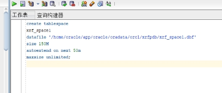

### 第一章 系统概述

​		网上图书商城，顾名思义，网站式的书店。是一种高质量，更快捷，更方便的购书方式。其规模相比一般书店要大，网上图书商城不仅可用于图书的在线销售，也有音碟、影碟的在线销售。而且网站式的书城对图书的管理更加合理化，信息化。售书的同时还具有书籍类商品管理、购物车、订单管理等功能，非常灵活的网站内容和文章管理功能。但网上书城的真实性是消费者的最大顾虑，这也是网上书店还不被大多数消费者所接受的原因之一。

### 第二章 业务流程

​		业务或业务活动是对组织或企业的一切专业工作和活动的总称。业务流程图是根据系统详细调查过程中所得的资料和问卷调查的结果，按业务实际处理过程绘制成的图。

1. 用户获取到所有的图书信息，可以将其放入购物车。

2. 在购物车中可以修改图书数量，并可以提交订单，清空购物车

3. 在用户购买书籍后，相应的书籍的库存里对减少图书的数量，并且生成对应的订单。

### 第三章 实体分析

#### 3.1实体模型

1. 图书（book）：图书编号(book_no)、图书名称(book_name)、图书分类(book_class)、图书作者(book_author)、出版舍(book_out)、图书单价(book_price)，图书数量（book_num）


2. 购物车（cart）:购物车编号(cart_no)，购物车价格(cart_price)，购物车数量(section_num)，购物车用户(cart_user)

   

3. 订单（order）:订单编号(order_no)，订单用户(order_user)，订单类型(order_type)，订单日期(order_date)，订单数量(order_num)，订单价格(order_price)，结算时间(order_pay_data)


4. 用户（user）:用户编号(user_no)，用户姓名(user_name)，性别(sex)，出生日期(birthday)，联系电话(tel)，住址(address)。


5.  图书-订单（book_order）,图书编号（book_no），订单编号（order_no），数量（num）


6. 图书-购物车（book_cart），图书编号（book_no），购物车编号（cart_no），数量（num）


#### 3.2实体模型联系

1. 一本图书可在多个购物车里，一个购物车里可有多个图书。


2. 同理，图书和订单的关系


3. 一个人可以有多个订单


4. 一个用户只有一个购物车


### 第四章 数据表的设计

1. 图书表

| 属性名      | 数据类型 | 是否为空 | 主键/外键 | 取值范围 |
| ----------- | -------- | -------- | --------- | -------- |
| book_no     | char(5)  | 否       | 主键      |          |
| book_name   | char(20) | 否       |           |          |
| book_class  | char(8)  | 否       |           |          |
| book_author | char(10) |          |           |          |
| book_out    | char(10) |          |           |          |
| book_num    | int      | 否       |           | 大于0    |
| book_price  | float    | 否       |           | 大于0    |

2.购物车表

| 属性名     | 数据类型 | 是否为空 | 主键/外键 | 取值范围 |
| ---------- | -------- | -------- | --------- | -------- |
| cart_no    | char(5)  | 否       | 主键      |          |
| cart_price | char(5)  | 否       |           | 大于0    |
| cart_num   | char(10) |          |           | 大于0    |
| cart_user  | char(20) | 否       | 外键      |          |

3. 订单表

| 属性名         | 数据类型 | 是否为空 | 主键/外键 | 取值范围 |
| -------------- | -------- | -------- | --------- | -------- |
| order_no       | char(5)  | 否       | 主键      |          |
| order_user     | char(10) | 否       | 外键      |          |
| order_class    | char(5)  | 否       |           |          |
| order_date     | char(11) | 否       |           |          |
| order_price    | char(5)  |          |           | 大于0    |
| order_pay_date | char(11) |          |           |          |
| order_num      | float    |          |           | 大于0    |

4. 用户表

| 属性名    | 数据类型 | 是否为空 | 主键/外键 | 取值范围 |
| --------- | -------- | -------- | --------- | -------- |
| user_no   | char(5)  | 否       | 主键      |          |
| user_name | char(10) | 否       |           |          |
| sex       | char(2)  | 否       |           | 男，女   |
| phone     | char(5)  | 否       |           |          |
| address   | char(10) | 否       |           |          |
| birthday  | char(10) | 否       |           |          |

5. 图书-订单表

| 属性名   | 数据类型 | 是否为空 | 主键/外键 | 取值范围 |
| -------- | -------- | -------- | --------- | -------- |
| book_no  | char(5)  | 否       | 主键      |          |
| order_no | char(5)  | 否       | 主键      |          |
| num      | int      | 否       |           | 大于0    |

6. 图书-购物车表

| 属性名  | 数据类型 | 是否为空 | 主键/外键 | 取值范围 |
| ------- | -------- | -------- | --------- | -------- |
| book_no | char(5)  | 否       | 主键      |          |
| cart_no | char(5)  | 否       | 主键      |          |
| num     | Int      | 否       |           | 大于0    |

### 第五章 创建数据库，表空间，表，用户

#### 5.1创建数据库以及管理员

```SQL
create p1uggable database xrfpdb admin user xrf identified by 123 file_name_convert=('/home/orac1e/app/orac1e/oradata/orc1/pdbseed/','/home/orac1e/app/orac1e/oradata/orc1/xrfpdb');
```


#### 5.2 创建表空间

```sql
Create	tablespace	xrf_space1datafile '/home/oracle/app/oracle/oradata/orcl/xrfpdb/xrf_space1.dbf' size 150M autoextend on next 50m maxsize unlimited;

 

create tablespace xrf_space2 DATAFILE
'/home/oracle/app/oracle/oradata/orcl/xrfpdb/xrf_space2.bdf' SIZE 50M AUTOEXTEND ON NEXT 5M MAXSIZE 100M;

 

create tablespace xrf_space3 DATAFILE
'/home/oracle/app/oracle/oradata/orcl/xrfpdb/xrf_space3.bdf' SIZE 50M AUTOEXTEND ON NEXT 5M MAXSIZE 100M;

 

create tablespace xrf_space4 DATAFILE
'/home/oracle/app/oracle/oradata/orcl/xrfpdb/xrf_space4.bdf' SIZE 50M AUTOEXTEND ON NEXT 5M MAXSIZE 100M;
```



#### 5.3 创建表以及将registration_form表进行分区

1. 创建图书表

```sql
create table book(

    book_no char(5) not null primary key,
  
    book_name char(20) not null,

    book_class char(8),

    book_author char(10),

    book_out char(10),

    book_price float not null CHECK(intake_price > 0),

    book_num float not null CHECK(outtake_price > 0)

)TABLESPACE xrf_space1;
```


2. 创建购物车表

   ```SQL
   create table cart (
   
       cart_no char(5) not null primary key,
   
       cart_num int not null,
   
       cart_price float,
   
       cart_user char(10)  FOREIGN KEY (user_no) REFERENCES user (user_no)
   
   )TABLESPACE xrf_space1;
   ```

   


3. 创建订单表

```SQl
create table order(

    order_no char(5) not null primary key,

    order_num int) not null,

    order_price float not null,

    order_type char(11),

		order_date char(5),

		order_pay_date char(5),

		order_user char(5)  FOREIGN KEY (user_no) REFERENCES user (user_no)

   )TABLESPACE xrf_space1;
```


4. 创建用户表

```SQl
create table user (

    user_no char(5) not null primary key,

    user_name char(10) not null,

    sex char(2) not null CHECK(sex IN ('男','女')),

    address char(5) not null,

    phone char(10),

		birthday date not null,

)TABLESPACE xrf_space1;
```


5. 创建图书-购物车表

   

```sql
create table book_cart (

    book_no char(5) not null  FOREIGN KEY (book_no) REFERENCES book (book_no),

    cart_no char(10) not null  FOREIGN KEY (cart_no) REFERENCES cart (cart_no),

		num int not null,

)TABLESPACE xrf_space1;
```


6. 创建图书-订单表

```sql
create table book_order (

    book_no char(10) not null  FOREIGN KEY (book_no) REFERENCES book (book_no),

    order_no char(10) not null  FOREIGN KEY (order_no) REFERENCES order (order_no),

		num int not null,

)TABLESPACE xrf_space1;
```


#### 5.3 创建用户，授权，插入数据

1. 分别创建两个用户xrf_user1和xrf_user2,并允许他们是使用xrf_space1表空间

```sql
create user xrf_user1 IDENTIFIED by 123;

create user xrf_user2 IDENTIFIED by 123;

alter user xrf_user1 quota unlimited on xrf_space1;

alter user xrf_user2 quota unlimited on xrf_space1;
```


2. 创建两个角色xrf_role1，xrf_role2，并分别赋予xrf_role1，xrf_role2读任何表和读、修改任何表的权利

```sql
create role xrf_role1;

create role xrf_role2;

grant select any table to xrf_role1;

grant select any table to xrf_role2;

grant update any table to xrf_role2;
```


3. 将xrf_role1，xrf_role2分别赋予给用户xrf_user1，xrf_user2

```sql
grant xrf_role1 to xrf_user1;

grant xrf_role2 to xrf_user2;
```


4. 向表中插入数据

```sql
declare
  dt date;
  registration_no char(5);
  registration_class char(15);
  exit_  char(20);
  price float;
begin
  insert into book(book_no,book_name,book_class,book_author,book_num,book_price,book_out) values ('1','java从入门到精通','计算机','xrf',100,12.5,'人民出版社');
  insert into book(book_no,book_name,book_class,book_author,book_num,book_price,book_out) values ('2','Python从入门到精通','计算机','xrf',200,22.5,'人民出版社');
  insert into book(book_no,book_name,book_class,book_author,book_num,book_price,book_out) values ('3','哈利波特','科幻','xrf',400,50.5,'国外出版社');
  insert into book(book_no,book_name,book_class,book_author,book_num,book_price,book_out) values ('4','C/C++从入门到精通','计算机','xrf',120,12.5,'人民出版社');
  insert into book(book_no,book_name,book_class,book_author,book_num,book_price,book_out) values ('5','红高粱','爱情','莫言',100,10.5,'人民出版社');

    for i in 1..50000
  loop
    if i mod 3 =0 then
      dt:=to_date('2018-01-01','yyyy-mm-dd')+(i mod 60); 

--PARTITION_2018
    elsif i mod 6 =1 then
      dt:=to_date('2019-01-01','yyyy-mm-dd')+(i mod 60); 

--PARTITION_2019
    elsif i mod 6 =2 then
      dt:=to_date('2020-01-01','yyyy-mm-dd')+(i mod 60); 

--PARTITION_2020
    end if;
       --插入订单
    registration_no := i;
    office_no := case i mod 6 when 0 then '1001' when 1 then '1002' when 2 then '1003' when 4 then '1004' else '1005'end;
   registration_class := CASE i MOD 4 WHEN 0 THEN '科幻' WHEN 1 THEN '计算机' WHEN 2 THEN'爱情'WHEN 3 THEN '生活' END;
     exit_ := CASE i MOD 2 WHEN 0 THEN '是' ELSE '否' end;
     price := dbms_random.value(5,30);
    insert /*+append*/ into REGISTRATION_FORM (cart_no,book_no,book_class,exit_,price,registration_date)
values (registration_no,cart_no,registration_class,exit_,price,dt);
  
  end loop;
end;
```


### 第六章 建立程序包

统计一段时间内的卖书总收入；统计一段时间内，各个种类的图书的销售数量：

```sql
create or replace PACKAGE MyPack 

  FUNCTION Get_TOTAL(dt1 char,dt2 char) RETURN NUMBER;

  PROCEDURE get_people(dt1 char,dt2 char);

END MyPack;


create or replace PACKAGE BODY MyPack 

FUNCTION Get_TOTAL(dt1 char,dt2 char) RETURN NUMBER

  AS

    N  NUMBER;

    BEGIN

     select sum(price) into N from REGISTRATION_FORM where REGISTRATION_DATE >= to_date(dt1,'yyyy-mm-dd hh24:mi:ss')

     and REGISTRATION_DATE <= to_date(dt2,'yyyy-mm-dd hh24:mi:ss');

       RETURN N;

    END;

 

-- 各个种类的图书的销售数量

PROCEDURE get_people(dt1 char,dt2 char)

  AS

    a1 NUMBER;

    b1 NUMBER;

    c1 NUMBER;

    d1 NUMBER;

    cursor cur is

      select * from REGISTRATION_FORM where REGISTRATION_DATE >= to_date(dt1,'yyyy-mm-dd hh24:mi:ss')

      and REGISTRATION_DATE <= to_date(dt2,'yyyy-mm-dd hh24:mi:ss');

    begin

     a1 := 0;

      b1 := 0;

      c1 := 0;

      d1 := 0;

      for v in cur 

      LOOP

         if v.REGISTRATION_CLASS = '科幻'

	        then a1 := a1 + 1;

         elsif v.REGISTRATION_CLASS = '计算机'

	        then b1 := b1 + 1;

	     elsif v.REGISTRATION_CLASS = '爱情'

	        then c1 := c1 + 1;

	     elsif v.REGISTRATION_CLASS = '生活'

	        then d1 := d1 + 1;

	     end if;

     END LOOP;

      DBMS_OUTPUT.PUT_LINE('科幻类图书数量为：' ||  a1);

      DBMS_OUTPUT.PUT_LINE('计算机类图书数量为：' ||  b1);

      DBMS_OUTPUT.PUT_LINE('爱情类图书数量为：' ||  c1);

      DBMS_OUTPUT.PUT_LINE('生活类图书数量为：' ||  d1);

    end;

END MyPack;
```


### 第七章 恢复备份

1. 编写rman增量备份脚本

```shell
#rman_level1.sh 
#!/bin/sh

export NLS_LANG='SIMPLIFIED CHINESE_CHINA.AL32UTF8'

export ORACLE_HOME=/home/oracle/app/oracle/product/12.1.0/dbhome_1  

export ORACLE_SID=orcl  

export PATH=$ORACLE_HOME/bin:$PATH  

rman target / nocatalog msglog=/home/oracle/rman_backup/lv1_`date +%Y%m%d-%H%M%S`_L0.log << EOF

run{

configure retention policy to redundancy 1;

configure controlfile autobackup on;

configure controlfile autobackup format for device type disk to '/home/oracle/rman_backup/%F';

configure default device type to disk;

crosscheck backup;

crosscheck archivelog all;

allocate channel c1 device type disk;

backup as compressed backupset incremental level 1 database format '/home/oracle/rman_backup/dblv1_%d_%T_%U.bak'

   plus archivelog format '/home/oracle/rman_backup/arclv1_%d_%T_%U.bak';

report obsolete;

delete noprompt obsolete;

delete noprompt expired backup;

delete noprompt expired archivelog all;

release channel c1;

}

EOF

exit
```

2. 开启全备份

```
[oracle@oracle-pc ~]$ cat rman_level0.sh

[oracle@oracle-pc ~]$ ./rman_level0.sh
```


3. 每天定时开始增量备份

```
[oracle@oracle-pc ~]$ cat rman_level1.sh

[oracle@oracle-pc ~]$ ./rman_level1.sh
```


4. 备份后修改数据

```sql
oracle@oracle-pc ~]$ sqlplus study/123@pdborcl

SQL> create table t1 (id number,name varchar2(50));

SQL> insert into t1 values(1,'zhang');1 row created.

SQL> commit;

SQL> select * from t1;

SQL> exit
```


5. 删除数据库，模仿数据库被损坏

```
[oracle@oracle-pc~]$rm /home/oracle/app/oracle/oradata/orcl/pdborcl/SAMPLE_SCHEMA_users01.dbf
```


6. 修改

```sql
oracle@oracle-pc ~]$ sqlplus study/123@pdborcl

SQL> insert into t1 values(2,'wang');

SQL> commit;

SQL> select * from t1;

SQL> declare

  2  n number;

  3  begin

  4    for n in 1..10000 loop

  5      insert into t1 values(n,'name'||n);

  6    end loop;

  7  end;

SQL> select * from t1;

SQL> exit
```


7. 数据库启动到mount状态

```sql
oracle@oracle-pc ~]$ sqlplus / as sysdba

SQL> shutdown immediate

SQL> shutdown abort

SQL> startup mount

SQL> exit
```


8. 开始恢复数据库

```
oracle@oracle-pc ~]$ rman target /

RMAN> restore database ;

RMAN> recover database;

RMAN> alter database open;

Statement processed

RMAN> exit
```


9.  查看数据库是否恢复

```sql
oracle@oracle-pc ~]$ sqlplus study/123@pdborcl

SQL> select * from t9;
```

